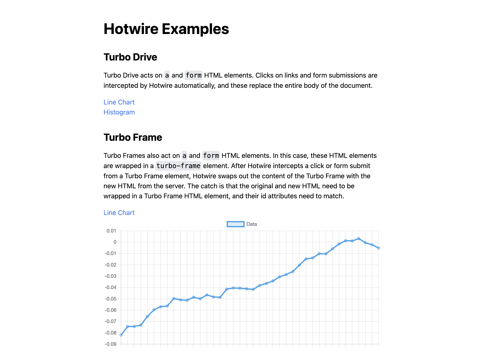

# Proof of Concept using Hotwire



This project utilizes Hotwire technologies like Turbo Drive and Turbo Frames to provide a server side rendered Django application with a more performant and dynamic user experience.

## Lessons Learned

### Turbo Drive

Turbo Drive acts on `a` and `form` DOM elements. Clicks on links and form submissions are intercepted by Hotwire automatically, and these replace the **entire body** of the document.

### Turbo Frame

Turbo Frames also act on `a` and `form` DOM elements. In this case, these DOM elements are wrapped in a `turbo-frame` element. After Hotwire intercepts a click or form submit from a Turbo Frame element, Hotwire swaps out the content of the Turbo Frame with the new HTML fragment from the server. The catch is that the original and new HTML fragment needs to be wrapped in a Turbo Frame DOM element, and their ID attributes need to match.

### Turbo Stream

Turbo Streams allow you to update multiple DOM elements on a page with one AJAX request. As before, once a user interacts with a `a` or `form` DOM element, Hotwire intercepts that HTTP request, turns it into an AJAX request, and then the Django view function assinged to that endpoint can modify multiple elements on the page. Using the `django-turbo-helper` Django app, we can return a Turbo Stream Response that can modify multiple DOM elements, each using one of seven supported Turbo Stream actions: append, prepend, update, replace, remove, before, or after.

### Summary

  - Turbo Drive is the simplest and most general tool, it replaces the entire body of the page using AJAX, and it is triggered by either `a` or `form` DOM elements.
  - Turbo Frame allows you to update a single section of the DOM, wrapped in a `turbo-frame` HTML element, using AJAX.
  - Turbo Stream allows you to update multiple sections of the DOM per AJAX response. The controller code will fragments of HTML to specific DOM elements, identified by unique IDs.

## Getting Started

In `backend`, in one terminal, run:

```bash
python3 manage.py tailwind start
```

In another terminal, run:

```bash
python3 manage.py runserver
```

## Resources

  - [Django Tailwind](https://django-tailwind.readthedocs.io/en/latest/installation.html)
  - [Django Browser Reload](https://github.com/adamchainz/django-browser-reload)